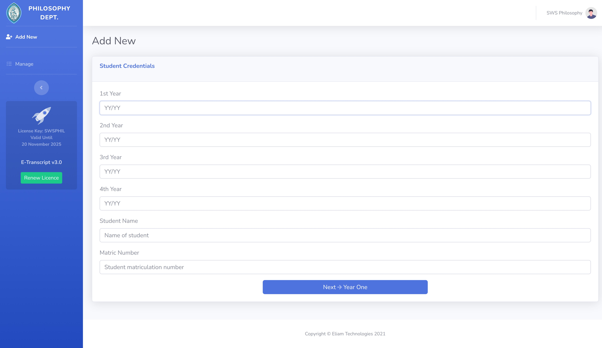
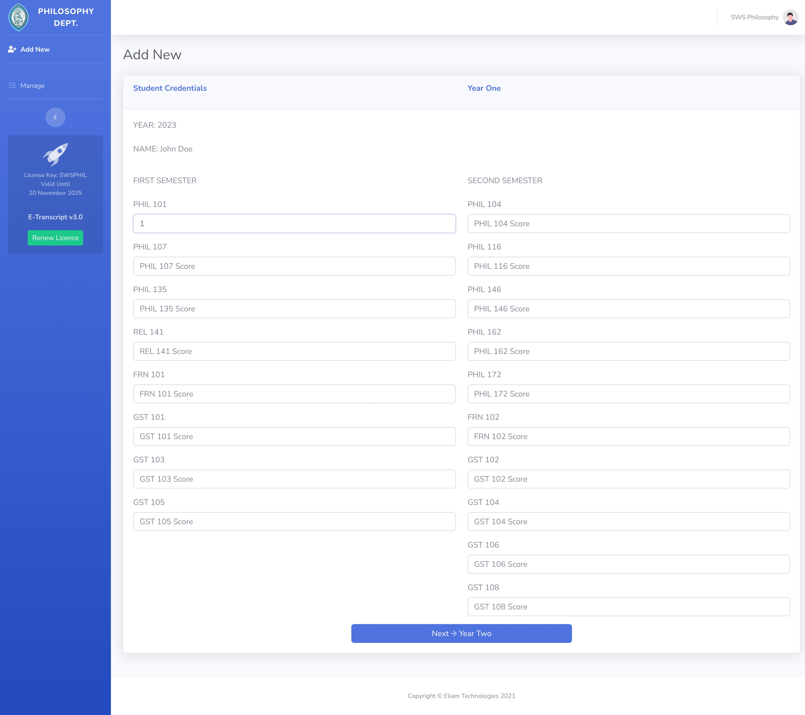
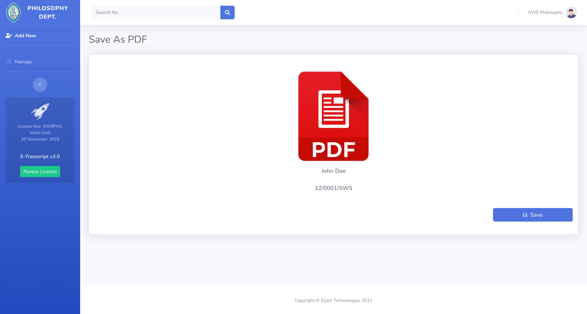
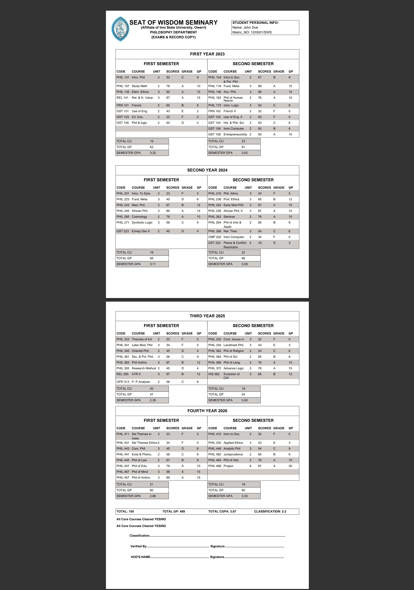
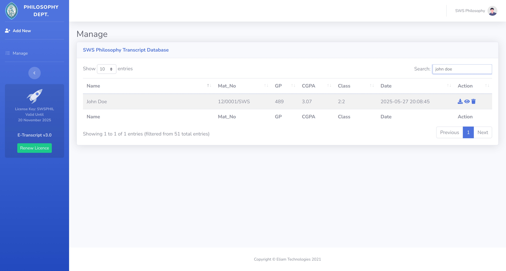
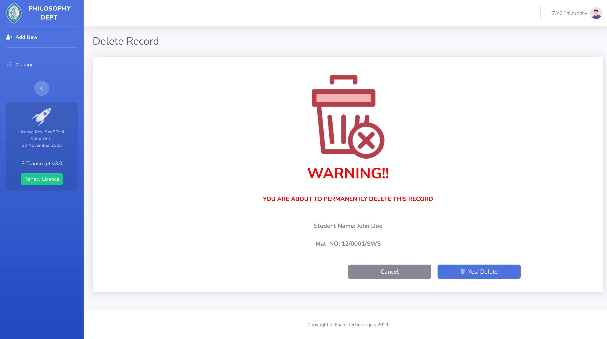

# E-Transcript-App

**Generate, manage, and securely store student academic transcripts for your educational institution, with integrated PDF export.**

[](https://opensource.org/licenses/MIT)
[](https://github.com/chiemela/E-Transcript-App/commits/main)
[](https://github.com/chiemela/E-Transcript-App)

**Repository Link:** [https://github.com/chiemela/E-Transcript-App](https://github.com/chiemela/E-Transcript-App)

E-Transcript-App is a comprehensive web solution built with **procedural PHP**, HTML, CSS, and JavaScript, designed to simplify the process of generating, managing, and securing student academic transcripts for schools and educational institutions. Our platform provides a user-friendly interface for record management, crucial data integrity, and the ability to export transcripts directly into professional PDF documents.

---

## Table of Contents

*   [About The Project](#about-the-project)
*   [Key Features](#key-features)
*   [Technology Stack](#technology-stack)
*   [Getting Started](#getting-started)
    *   [Prerequisites](#prerequisites)
    *   [Installation](#installation)
*   [Usage](#usage)
*   [Screenshots](#screenshots)
*   [Contributing](#contributing)
*   [License](#license)
*   [Contact](#contact)
*   [Acknowledgements](#acknowledgements)

---

## About The Project

Managing student academic records can be a complex and time-consuming task for schools. E-Transcript-App streamlines this entire workflow, offering a robust web-based platform to:

*   **Generate professional-looking student transcripts** and instantly export them as PDF files.
*   **Organize and manage all transcripts** in a centralized, digital hub.
*   Ensure data is never lost with automatic, secure cloud backups (assuming this refers to database backups).
*   Maintain the confidentiality and integrity of sensitive student information through restricted access.

Built using a reliable stack of **procedural PHP** for backend logic, and HTML, CSS, JavaScript for a responsive frontend, E-Transcript-App offers a robust and easy-to-use system for academic record keeping.

---

## Key Features

*   📄 **Effortless Transcript Generation & PDF Export:** Quickly create accurate and professional student transcripts and download them as high-quality PDF files.
*   🗂️ **Centralized Management:** "All transcripts, easy management." Manage all student transcripts and associated records in one convenient location.
*   ☁️ **Automatic Backup & Retrieve:** All transcripts (and underlying data) are designed to be backed up automatically to our secure servers (database). Easily retrieve them whenever needed.
*   🔒 **Maximum Security & Confidentiality:** We understand document integrity. Restricted access controls protect sensitive student information from unauthorized access.
*   ⚙️ **Intuitive User Interface:** Designed for ease of use by school administrators and staff, simplifying complex data entry and management tasks.
*   🗑️ **Record Deletion:** Securely delete outdated or incorrect transcript records when necessary.

---

## Technology Stack

*   **Backend:** Procedural PHP
*   **Frontend:** HTML5, CSS3, JavaScript
*   **Database:** MySQL / MariaDB (commonly used with PHP, please confirm if different)
*   **Web Server:** Apache / Nginx (required to run PHP applications)
*   **PDF Generation:** (Likely using a PHP library like FPDF, TCPDF, or Dompdf - consider adding the specific library if you know it!)

---

## Getting Started

To get a local copy of E-Transcript-App up and running on your server, follow these simple steps.

### Prerequisites

Ensure you have the following installed on your server environment:

*   **PHP:** Version 7.4+ (or your specific required version) with necessary extensions (e.g., `mysqli`, `gd`, `intl`, `mbstring`, `zip`).
*   **Web Server:** Apache or Nginx configured to serve PHP applications.
*   **Database Server:** MySQL or MariaDB.
*   **Git:** To clone the repository.

### Installation

1.  **Clone the repository:**
    ```sh
    git clone https://github.com/chiemela/E-Transcript-App.git
    cd E-Transcript-App
    ```

2.  **Move to your web server's document root:**
    Move the `E-Transcript-App` folder into your web server's public directory (e.g., `/var/www/html/` for Apache on Linux, or `htdocs` for XAMPP/WAMP).
    ```sh
    # Example for Linux/Apache:
    sudo mv E-Transcript-App /var/www/html/
    ```

3.  **Database Setup:**
    *   Create a new database for the application (e.g., `e_transcript_db`).
    *   Import the provided SQL schema file into your newly created database. Look for a file named `database.sql` or similar within the cloned repository.
        ```bash
        # Example using MySQL command line:
        mysql -u your_db_user -p e_transcript_db < path/to/E-Transcript-App/database.sql
        # Replace 'path/to/E-Transcript-App/database.sql' with the actual path
        ```

4.  **Configure Database Connection:**
    *   Locate the database configuration file (e.g., `config.php`, `db_connect.php`, or similar) within the project.
    *   Update the database credentials (hostname, username, password, database name) to match your setup.

5.  **Access the Application:**
    Open your web browser and navigate to the URL where your web server is hosting the application.
    ```
    http://localhost/E-Transcript-App/
    # Or your server's public IP/domain
    ```

---

## Usage

Once the application is set up and running:

1.  **Login/Access:** Navigate to the application URL in your browser. You'll likely see a login or initial setup page.
2.  **Add New Student:** Use the interface to add new student credentials (as seen in **View 1**).
3.  **Input Grades:** For each student, add and manage their academic grades and course information (as seen in **View 2**).
4.  **Cross-Check & Save:** Review all entered grades and data before finalizing and saving the record (as seen in **View 3**).
5.  **Generate & Download PDF:** Once saved, you can generate and download the student's complete transcript as a professional PDF document (as seen in **View 4**).
6.  **View Downloaded Transcript:** The generated PDF will contain the formatted transcript (as seen in **View 5**).
7.  **Manage Records:** Use the management dashboard to view, search, and organize all saved transcript records (as seen in **View 6**).
8.  **Delete Records:** If necessary, securely delete transcript records (as seen in **View 7**).

---

## Screenshots

Below are screenshots illustrating the key functionalities and user interface of the E-Transcript-App.

| View 1: Add New Student Credential       | View 2: Add New Grades                   | View 3: Cross-check All Grades Before Saving |
| :--------------------------------------: | :--------------------------------------: | :------------------------------------------: |
|  |  |  |

| View 4: Download Transcript Record as PDF | View 5: Downloaded Transcript PDF View | View 6: Manage Saved Transcript Record     | View 7: Delete Transcript Record         |
| :---------------------------------------: | :------------------------------------: | :----------------------------------------: | :--------------------------------------: |
|  |  |  |  |


---

## Contributing

Contributions are what make the open-source community such an amazing place to learn, inspire, and create. Any contributions you make are **greatly appreciated**.

If you have a suggestion that would make this better, please fork the repo and create a pull request. You can also simply open an issue with the tag "enhancement".
Don't forget to give the project a star! Thanks again!

1.  Fork the Project
2.  Create your Feature Branch (`git checkout -b feature/AmazingFeature`)
3.  Commit your Changes (`git commit -m 'Add some AmazingFeature'`)
4.  Push to the Branch (`git push origin feature/AmazingFeature`)
5.  Open a Pull Request

Please make sure to update tests as appropriate.

---

## License

Distributed under the MIT License. See `LICENSE.txt` for more information.

---

## Contact

Your Name / Organization Name - [your_email@example.com]

Project Link: [https://github.com/chiemela/E-Transcript-App](https://github.com/chiemela/E-Transcript-App)

---

## Acknowledgements

*   [Awesome Readme Templates](https://awesomeopensource.com/project/elangosundar/awesome-README-templates)
*   [Shields.io](https://shields.io/)
*   [Choose an Open Source License](https://choosealicense.com)
*   (Add specific PHP PDF library if known, e.g., FPDF, TCPDF, Dompdf)

---
